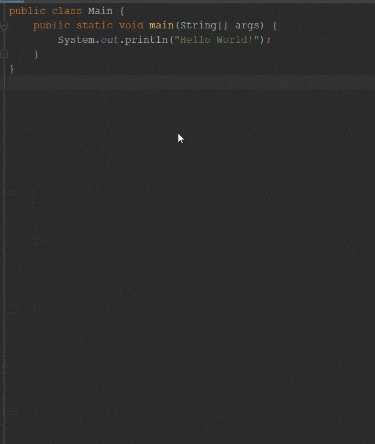
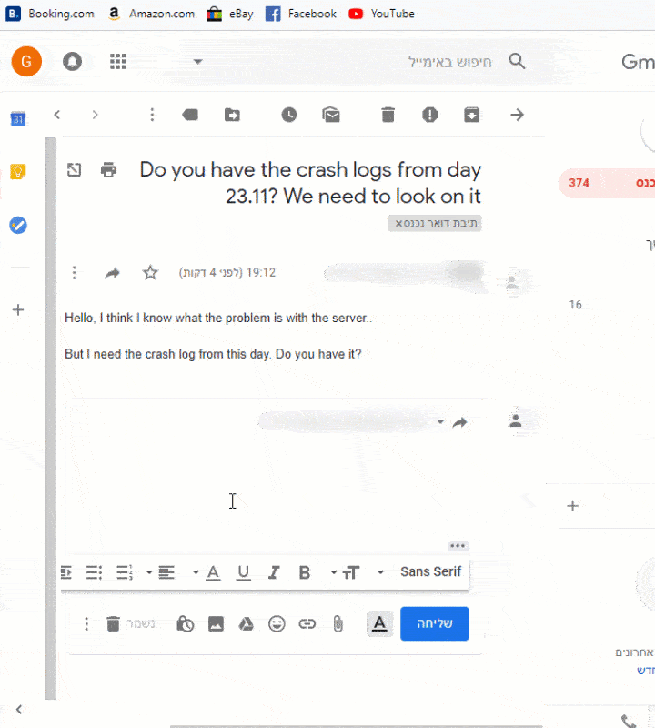

# JCopy - Java Clipboard Manager
JCopy is an Open Source application that helps you to work more easily buy managing your clipboard.

A lot of times you may need to type something that you already typed such as a piece of code, phone number, password and more. so you have to go to some document or whatever it be to get the stuff you need to type again.

With JCopy you can type it once and use it with the highest efficiency!

#

## Copy - Easily save all your copies
### Add tag, set copy display name, save copy to database and more ...

#### Quick save your copy with Ctrl + long C

By pressing CTRL and holding C, a new window will open with useful option to save the copy for later use.

by pressing CTRL + C (not holding C), or just coping from mouse right click menu, the copy will be saved without advanced details.

In the "save copy" window you can set tags (categories) for the copy and the display name.

These are used to easily identify the copy when you, later on, look for it.

By selecting the option "Save & Database Save", the new copy will be saved to database file so it will be saved also after restarting the computer/program.

You can select the option "Save" that will only save the copy on the memory so it will be deleted after you restart the computer/program.

#### Modify copy details

To modify copy details, open the "Copies List" window by pressing Ctrl + long V or by opening the window from the system tray.

In the "Copies List" Window, find the copy you are looking for (you can search for it by tag name and text).

You can add/remove tags, edit the copy itself and it displays name.

You can also remove selected copy by pressing the "Delete selected" button.

It will completely remove the copy even from the database (in case you enabled database save for the copy) To save the copy in the database also, enable the save option for the copy.

#

## Paste - Easily paste with CTRL + long V!
### No need to remember special hot-key. it is almost the same. just HOLD V!

#### Paste your copy with Ctrl + long V

To paste a copy, all you need to do is press CTRL + V but in this case, you need to hold V until the copies selection window will open.

Once the copies selection window is open, find the copy you need and then double click on it to paste it.

You can easily find the copy you need by searching it by text and/or by selecting tags.

# Author
Gil Eliyahu (gileli121@gmail.com)
